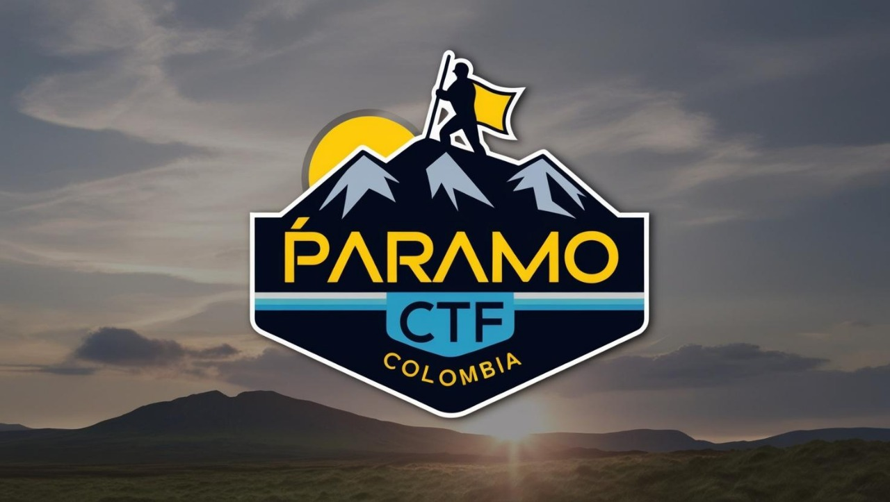

#  Páramo CTF Colombia 2025

¡Bienvenido a Páramo CTF Colombia 2025, el evento GRATUITO de ciberseguridad que reúne a los mejores talentos y entusiastas del área!

---

## ¿Qué te espera en el evento?

  

### Actividades principales
- **24 de abril – CTF de Ciberseguridad**  
  Demuestra tus habilidades en un desafiante Capture The Flag (CTF) y conviértete en el héroe de la seguridad informática.

- **25 de abril – Charlas Técnicas**  
  Aprende de la mano de expertos con charlas que abordan las últimas tendencias y técnicas en ciberseguridad.

- **26 de abril – Entrega de Premios**  
  Celebra los logros en una ceremonia de premiación con reconocimientos, stickers, libros, certificaciones, busos y camisas.

---

## Oportunidades Futuras

Además del emocionante evento de abril, ¡prepárate para nuevos retos!

- **CyberSecurity Challenge (julio)**  
  Desarrolla y potencia tus habilidades en ciberseguridad con este desafío de alto impacto.

- **ICC – Competencia Internacional (final del año)**  
  Demuestra tu capacidad a nivel global en la competencia insignia del año.  
  Conoce más en [ICC Latinoamérica](https://icclatinoamerica.org/).

---

## Características de la Plataforma

- **Registro de Equipos**  
  Forma tu equipo de 5 integrantes de manera sencilla e interactiva.  
  

    
  

- **Visualización de Equipos**  
  Descubre a los equipos inscritos a través de un elegante carrusel interactivo que muestra el nombre (y, opcionalmente, la imagen) de cada equipo con colores únicos.

- **Contador Dinámico**  
  Mantente informado con un contador en tiempo real que te indica cuánto falta para el inicio del evento.

- **Ubicación**  
  Encuentra fácilmente dónde se llevará a cabo el evento en la Escuela de Ingeniería de Antioquia (EIA).

---

## ¡Regístrate y vive la experiencia!

Los cupos son limitados. No pierdas la oportunidad de formar parte de una experiencia única en ciberseguridad.

[**Regístrate ahora**](#/registro)

---

## Redes Sociales

Síguenos para enterarte de todas las novedades y actualizaciones del evento:

- 
- 
- 

---

## Contacto

Para más información y actualizaciones, visita nuestro sitio web o contáctanos en nuestras redes sociales.

¡Te esperamos en Páramo CTF Colombia 2025 para vivir una experiencia inolvidable en el mundo de la ciberseguridad!
